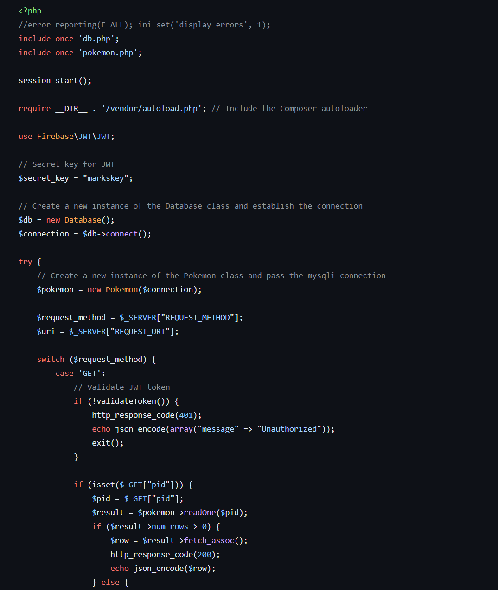

README for PHP REST API with JWT by Mark Alejandro Kevin Ablao

This is a rest-api with jwt authentication for a single user
to perform CRUD operations on database records, and can also be upgraded to multiple users with a few tweaks.

Links to code snippets I've use/read/learned to code this:
- https://www.youtube.com/watch?v=LAb5yJRz0e0
- https://github.com/owthub/php-rest-api-with-jwt
- https://www.codeofaninja.com/rest-api-authentication-example-php-jwt-tutorial/

Features:
 - Used vendor/autoload as required because it helps simplify the process of 
managing third party libraries
 - Used Firebase JWT Library for the use of JSON Web Tokens (JWT) in PHP

Note:
 - You need to have composer to install the features above.

Key Concepts learned:
- - https://www.codeofaninja.com/rest-api-authentication-example-php-jwt-tutorial/
- - - Refreshed my memory on how too create database on MariaDB on XAMPP

- - https://www.codeofaninja.com/rest-api-authentication-example-php-jwt-tutorial/
- - - Learned basics of POSTMAN to access API endpoints

- - https://github.com/owthub/php-rest-api-with-jwt/blob/master/classes/Users.php
- - - Creating functions for use on my API endpoints

How to perform CRUD operations and write queries using PHP:

- This CRUD functions on the screenshot is what I'm using on my API endpoints to perform crud
- They are name according to what they do to simplify things.
- - Note, anyone who has prior knowledge about SQL will find these functions easy to understand
  - - As for the ones who do not have prior knowledge of SQL, here is the breakdown
    - - The 1st function read() Selects all data drom my pokemontable and returns it as a result
    - - The 2nd function readOne() takes one parameter ID to select that specific ID 
        - if it exists and returns it as a result
    - - The 3rd function create() inserts into my table a new pokemon data using the 3 parameters
        - if they are not null
        - and autoincrements the primary key 
    - - The 4th function update() updates the record using the passed ID from the database
    - - The 5th function delete() deletes the record using the passed ID from the database

How to create REST API endpoints to perform CRUD operations using PHP.

- I used a switch case to create & determine my Endpoints and which one is being required (POST, GET, PUT, DELETE)
- - Then and if inside the GET to determine if its GET one record or GET ALL records
- - Each switch case (POST, GET, PUT, DELETE) have a method to validate token everytime they are called
- - And if operation is not valid, handle them and throw exceptions

Tutorial on how authenticate an database user and return a JWT using PHP

- First step is access the database with valid values.

- This is my database user

- This is my login to valid/authenticate user and return a JWT using PHP
- - The switch case will accept a POST with a parameter 
   - email & password
   - then if the email & password is valid
   - it will return a jwt token
   - using the method below
   - 

Tutorial on how to restrict access to REST API endpoints using PHP with JWT token
- Every one of my switch case (POST, GET, PUT, DELETE) has this method below
- 
  - to check for valid jwt token
  - This pic below is the whole validate method
  - 

Tutorial on how to logout and revoke an JWT token using PHP/
- Below is my logout code
- 
- 
- - When a user logouts
  - - This method stores the token to a blacklist SESSION
  - - 
  - - And in case someone tries to use again the users token(if not yet expired) who had logout
  - - This method below ensures that they cannot access the endpoint cause that user logout
  - - 
  - - - And that token is on my blacklist SESSION now
  - - - 
  - - - 